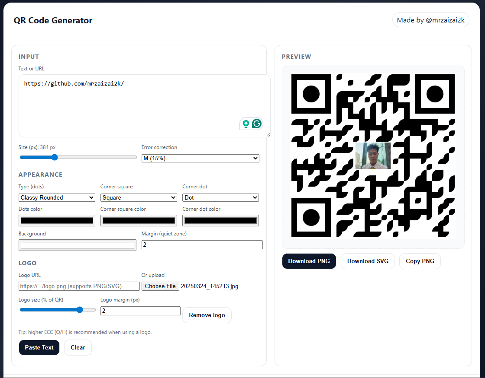

# Simple QR Generator

A **lightweight, free, and open-source** tool to generate customized QR codes.  
No subscriptions, no paywalls — just a simple QR generator that works.

👉 Try it here: [Simple QR Generator](https://mrzaizai2k.github.io/simple_qr_generator.html)

---

## ✨ Features
- Generate QR codes from text or URLs
- Customize colors, shapes, and styles
- Support for logos (upload or via URL)
- Adjustable size, margin, and error-correction levels
- Export to **PNG** or **SVG**
- Copy QR code directly to clipboard

---

## 🚀 Demo

